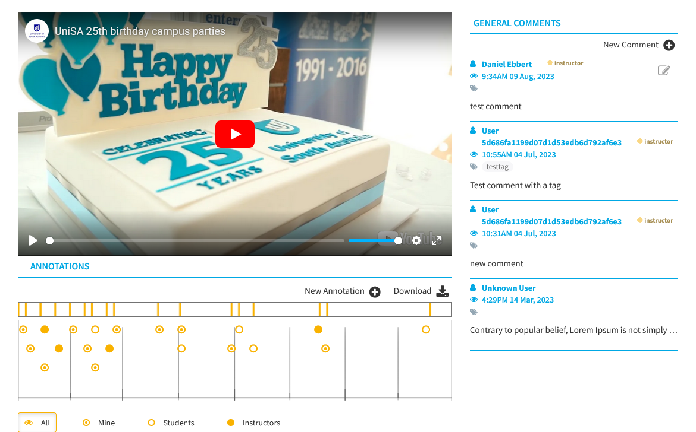

# OVAL Interactive Video Player

## Overview

OVAL Interactive Video Player is a robust, feature-rich video player that takes user engagement to the next level. Designed with educators, and researchers in mind, OVAL offers a range of interactive options to facilitate active learning and data-driven insights. It allows seamless embedding into Learning Management Systems (LMS) via LTI and utilises YouTube as the video source.

## Features

### Annotation
- Annotate videos in real-time.
- View annotations made by other users for collaborative learning and insights.

### Commenting
- Engage in discussions by adding comments directly on the video timeline.

### Video Source
- Uses YouTube as the primary video source, offering a wide range of content options.

### Quizzes
- Integrate multiple-choice or free-text quizzes at predetermined points within the video to test user comprehension.

### Tracking
- Full tracking of all user interactions, including annotations, comments, quiz responses, and viewing behaviour.

### LMS and LTI
- Easily embed the video player into any LMS supporting LTI.
- Access a standalone full-page version of the player when needed.

### Customisation Options
- Enable or disable annotations and comments.
- Choose which video player controls are available to the users.

### Data Export
- Export all user interaction data for further analysis, making it easier to improve content and understand user behaviour.

## Getting Started

To get started with OVAL Interactive Video Player, follow the installation guide in the `docs` folder.

## Contribution

Feel free to submit pull requests for new features or bug fixes, or create an issue to discuss modifications.

## Documentation

- [Development](docs/development.md)
- [Deployment](docs/deployment.md)
- [Setting up LTI in Canvas](docs/setting-up-lti-in-canvas.md)
- [Setting up LTI in Open edX](docs/setting-up-lti-in-openedx.md)

## License

[BSD 2-Clause](LICENSE)
