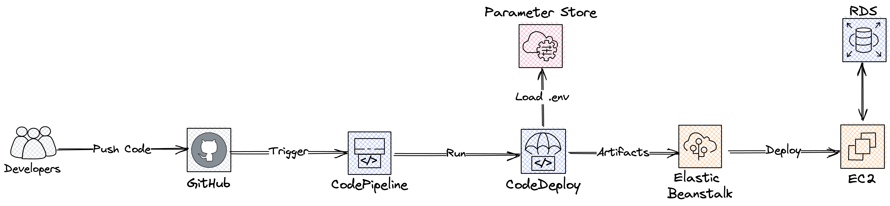

# Development Guide

## Prerequisites

- PHP >= 8.2
- [Composer](https://getcomposer.org/)
- [Node.js](https://nodejs.org/en/)
- [Vagrant](https://www.vagrantup.com/) - only required if using Homestead
- [VirtualBox](https://www.virtualbox.org/) - only required if using Homestead
- [Docker Desktop](https://www.docker.com/products/docker-desktop) or [OrbStack](https://orbstack.dev) - only required if using Sail

## Development

We strongly recommand use either [Homestead](https://laravel.com/docs/10.x/homestead) or [Sail](https://laravel.com/docs/10.x/sail) for local development.

### Clone the repository

```bash
$ git clone git@github.com:c3l-lab/OVAL.git
$ cd OVAL
```

### Create a `.env` file

```bash
$ cp .env.example .env
```

### Install dependencies

```bash
$ composer install
$ npm install
```

### Using Sail

```bash
$ ./vendor/bin/sail up
```

Setup the database:

```bash
$ ./vendor/bin/sail artisan migrate
$ ./vendor/bin/sail artisan db:seed
```

Open the application in your browser at [http://localhost](http://localhost).

```
Email: admin@example.com
Password: password
```

### Using Homestead

```bash
$ cp Homestead.example.yaml Homestead.yaml
```

Edit `folders.map` in the `Homestead.yaml` file to match your local environment.

Add the following line to your `/etc/hosts` file:

```bash
192.168.56.56   oval.test
```

Launch the virtual machine:

```bash
$ vagrant up
```

SSH into the virtual machine:

```bash
$ vagrant ssh
```

Setup the database (inside the virtual machine):

```bash
$ php artisan migrate
$ php artisan db:seed
```

Open the application in your browser at [http://oval.test](http://oval.test).

## Default User

```
Email: admin@example.com
Password: password
```

## Testing

Run unit tests:

```bash
$ php artisan test
```

Run E2E tests:

```bash
$ php artisan dusk
```

## Workflow

Daily development should be done on the `dev` branch. The `main` branch should only be updated when a new release is ready.

Pushing to the dev branch would trigger the deployment of the development instance, while pushing to the main branch would trigger the deployment of the production instance.

## Debugging

Laravel Logs can be found in `storage/logs/laravel.log`

## Deployment

Current deployment overview:



The development and production instances are hosted on the AWS. The deployment process is automated through the utilization of AWS CodePipeline and CodeBuild. Triggering the deployment process requires a push to either the main or dev branch of the GitHub repository or manannly click the relase button in the CodePipeline console. The build configuration is specified in the `cicd/buildspec.yml` file, while the Nginx configuration is defined within the `.platform/nginx` folder.
