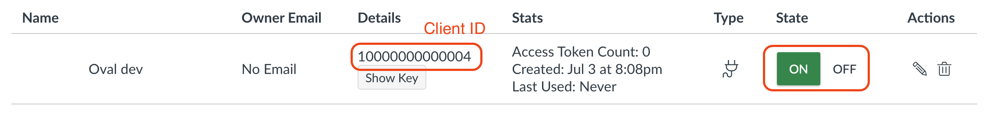

# Setting up LTI in Canvas

## Setting up LTI 1.1

### Setting up LTI connection in Oval

1. Head to the **Manage LTI 1.1 Connections** on Oval and add a new connection.

### Setting up LTI app in Canvas

1. Navigate to Settings in the admin navigation.
1. Click **Apps > +App**.
1. Choose **Manual Entry** and fill in the form and click **Submit**.

    - **Name**: set your preferred name
    - **Consumer Key**: the Key of the LTI connection
    - **Shared Secret**: the Secret of the LTI connection
    - **Launch URL**: https://oval.c3l.ai/api/lti/1.1/launch
    - **Domain**: https://oval.c3l.ai
    - **Privacy**: Public

## Setting up LTI 1.3

### Setting up LTI developer key

1. Log into Canvas as an admin and navigate to Admin section.
1. Navigate to Developer Keys in the navigation.
1. Add an LTI Key by clicking + Developer Key and choose LTI Key.
1. Fill in Key Settings information.

    - **Key Name**: set your preferred name
    - **Owner Email**: set your email
    - **Redirect URIs**: https://oval.c3l.ai/api/lti/1.3/launch
    - **Method**: choose **Manual Entry**
    - **Title**: set your preferred title (e.g. Oval)
    - **Description**: set your preferred description
    - **Target Link URI**: https://oval.c3l.ai/api/lti/1.3/launch
    - **OpenID Connect Initiation Url**: https://oval.c3l.ai/api/lti/1.3/login
    - **JWK Method**: choose **Public JWK URL**
    - **Public JWK**: https://oval.c3l.ai/api/lti/1.3/jwks

1. In the **Additional Settings** section, set the Privacy Level to **Public**.
1. Click **Save**.
1. In the Developer Keys list, find the key we just set up and toggle the State to **ON**, and copy the value (Client ID) in Details column.

    

1. Navigate to Settings in the admin navigation.
1. Click **Apps > +App**.
1. Choose **By Client ID** as configuration type and enter the Client ID of the Developer Key (from previous step).
1. Click **Submit** and click **Install**.
1. Save your Deployment ID.

    

    

### Setting up LTI registration in Oval

1. Head to the **Manage LTI 1.3 Registrations** on Oval and click on **Add**.
1. Fill in the form and click **Save**.

    - **Name**: set your preferred name
    - **Issuer**: https://canvas.instructure.com
    - **Client ID**: the Client ID of the Developer Key
    - **Deployment ID**: the Deployment ID from the previous step
    - **Keyset URL**: https://canvas.c3l.ai/api/lti/security/jwks
    - **Access Token URL**: https://canvas.c3l.ai/login/oauth2/token
    - **Login URL**: https://canvas-dev.c3l.ai/api/lti/authorize_redirect

## Setting up a LTI module in Canvas course

1. Choose **External Tool** in module modal.
1. Select the tool you just set up in previous steps.
1. Fill in URL filed:

  - **Video Management**: https://oval-dev.c3l.ai/api/lti/1.1/launch?resource_type=group_video
  - **Video**: https://oval-dev.c3l.ai/api/lti/1.1/launch?resource_type=group_video&resouce_id=12

1. Fill in other fileds as you like.
1. Click **Add Item**.

